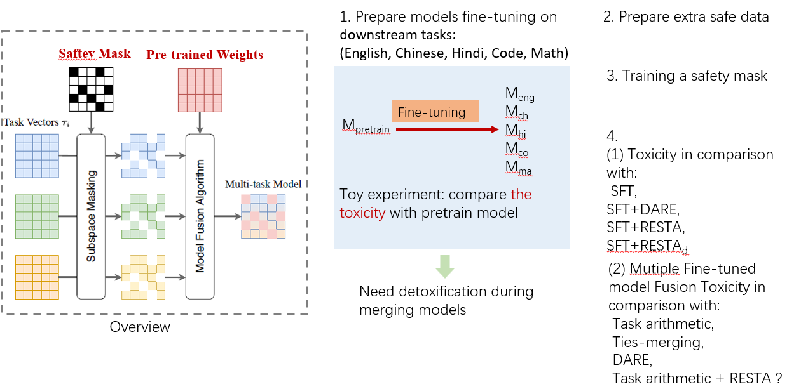

# Safety Re-Alignment of Fine-tuned Language Models through Model Fusion


## 1. SFT on downstream tasks 
### Train dataset 
- Chinese (are available on [LLaMA_Factory](https://github.com/hiyouga/LLaMA-Factory) (./llama_factory/data/alpaca_gpt4_data_en.json)
- English (./llama_factory/data/alpaca_gpt4_data_zh.json)
- Hindi ()
- Code ()
- Math ()

### Evaluation dataset
- Chinese (XCOPA, ./lm_eval/tasks/xcopa/default_zh.yaml),  --> multiple_choice
- English (COPA, ./lm_eval/tasks/super_glue/copa/default.yaml)

````

````
## 2. Prepare safe data for training a safe mask
- Following the dataset provided in method [PKU_Beaver](https://github.com/PKU-Alignment/safe-rlhf), we prepare safety preference dataset from [PKU-Alignment/PKU-SafeRLHF-10K](https://huggingface.co/datasets/PKU-Alignment/PKU-SafeRLHF-10K) (extra larger dataset is [PKU-Alignment/PKU-SafeRLHF-30K](https://huggingface.co/datasets/PKU-Alignment/PKU-SafeRLHF-30K)). 
````

````

## 3. Train a safe mask for indicating a safe region in the weight space

````

````

## 4. Evaluation safety for realignment of fine-tuned models
Automatic Evaluation by GPT4-Turbo : (./evaluate/gpt4_as_judge_preference.py)

### Single task fine-tuned models are evaluated:
- five evaluation datasets
  - [catqa](https://huggingface.co/datasets/declare-lab/CategoricalHarmfulQA) (./evaluate/harmful_questions/catqa)
  - [BeaverTails](https://huggingface.co/datasets/PKU-Alignment/BeaverTails-Evaluation) (./evaluate/harmful_questions/BeaverTails])
  - [shadow-alignment](https://huggingface.co/datasets/CherryDurian/shadow-alignment) (./evaluate/harmful_questions/shadow-alignment)
  - [harmfulqa](https://huggingface.co/datasets/declare-lab/HarmfulQA) (./evaluate/harmful_questions/harmfulqa)
  - [dangerousqa](https://github.com/SALT-NLP/chain-of-thought-bias/blob/main/data/dangerous-q/toxic_outs.json) (./evaluate/harmful_questions/dangerousqa)

- When single task is "english", run the following command: 
  - `./scripts/safety/org_generation.sh`, 
  - `./scripts/safety/sft_alpaca_en_generation.sh`,
  - `./scripts/safety/eval_sft_to_org.sh`

````

````
### Fusion model fine-tuned on multi-task datasets
````

````
## OVERVIEW
````
.
├── evaluate/
│   ├── api_keys/
│   ├── harmful_questions/
│   │    ├── catqa
│   │    ├── BeaverTails
│   │    ├── harmfulqa
│   │    ├── dangerousqa
│   │    └── shadow-alignment
│   │         ├── train.json (as unsafe data for sft)
│   │         └── eval.json (for safety evaluation)
│   ├── generate_responses.py
│   └── gpt4_as_judge_preference.py
│ 
├── llama_factory/
├── lm_eval/ (eval downstream tasks: COPA, XCOPA, etc.)
│ 
├──saved models/
│    ├── sft/
│    │    ├── peft_alpaca_en_llama2-chat-7b
│    │    ├── peft_alpaca_en_llama2-chat-7b-checkpoint-1600-merged
│    │    ├── ...
│    ├── safety_mask/
│
├── scripts/
│    ├── performance/
│    │    ├── english_peft.sh (PEFT on English)
│    │    ├── chinese_peft.sh (PEFT on Chinese)
│    │    ├── hindi_peft.sh (PEFT on Hindi)
│    │    ├── math_peft.sh (PEFT on Math)
│    │    ├── code_peft.sh (PEFT on Code)
│    │    ├── eval_base.sh (pretrained model evaluation on downstream tasks)
│    │    └── eval_peft.sh (sft model evaluation on downstream tasks)
│    │    
│    ├── safety/
│    │    ├── org_generation.sh (generate responsee from pretrained model)
│    │    ├── sft_alpaca_en_generation.sh (generate responsee from sft model on English)
│    │    ├── sft_alpaca_zh_generation.sh (generate responsee from sft model on Chinese)
│    │    ├── eval_sft_to_org.sh (safety evaluation compare sft and org)
│ 
├── merging_results.xlsx (all results are recorded here)
├── requirements.txt
└── README.md
````
