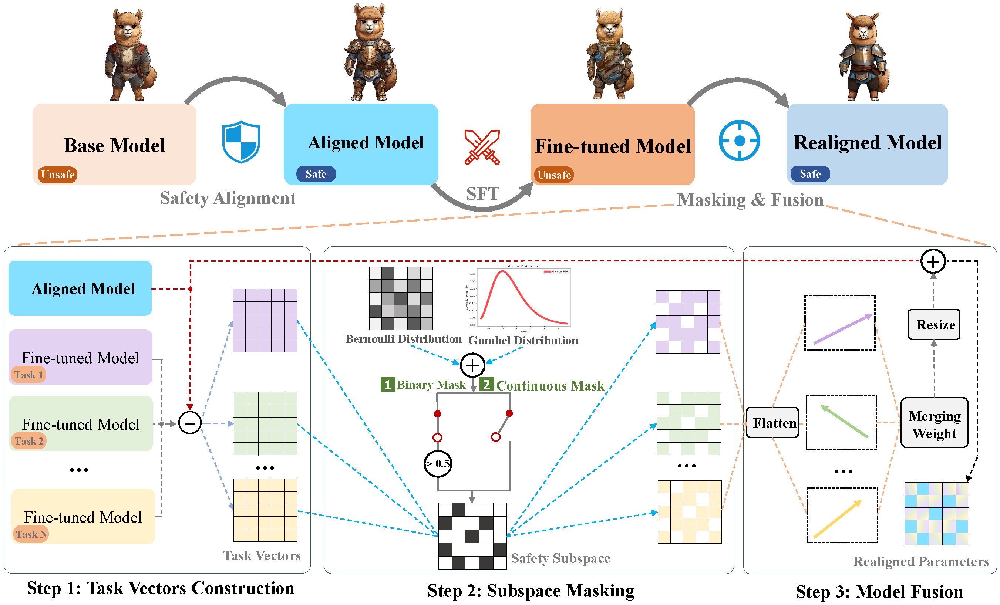

# A safety realignment framework via subspace-oriented model fusion
for large language models


## 1. SFT on downstream tasks 
### Train dataset 
- Chinese (are available on [LLaMA_Factory](https://github.com/hiyouga/LLaMA-Factory) (./llama_factory/data/alpaca_gpt4_data_en.json)
- English (./llama_factory/data/alpaca_gpt4_data_zh.json)
- Hindi ([https://huggingface.co/datasets/iamshnoo/alpaca-cleaned-hindi](https://huggingface.co/datasets/iamshnoo/alpaca-cleaned-hindi)))
- Code ([https://huggingface.co/datasets/sahil2801/CodeAlpaca-20k](https://huggingface.co/datasets/sahil2801/CodeAlpaca-20k))
- Math ([https://huggingface.co/datasets/gsm8k](https://huggingface.co/datasets/gsm8k))

### Evaluation dataset
Based on repo: [lm_eval](https://github.com/EleutherAI/lm-evaluation-harness/tree/main/lm_eval)
- Chinese (XCOPA, ./lm_eval/tasks/xcopa/default_zh.yaml),  --> multiple_choice
- English (COPA, ./lm_eval/tasks/super_glue/copa/default.yaml)
- Hindi (XNLI, ./lm_eval/tasks/xnli/default.yaml)
- Math (GSM8K, ./lm_eval/tasks/gsm8k/default.yaml) 

Code based on repo: [instruct_eval](https://github.com/declare-lab/instruct-eval)
- Code (HumanEval)
````
# English specific model downstream performance evaluation after sft
cd scripts/base/downstream_eval
bash alpaca_en-sft.sh
````
## 2. Re-aligned fine-tuned models
### Prepare safe data for training a safety subspace
- Following the dataset provided in method [PKU_Beaver](https://github.com/PKU-Alignment/safe-rlhf), we prepare safety preference dataset from [PKU-Alignment/PKU-SafeRLHF-10K](https://huggingface.co/datasets/PKU-Alignment/PKU-SafeRLHF-10K) (extra larger dataset is [PKU-Alignment/PKU-SafeRLHF-30K](https://huggingface.co/datasets/PKU-Alignment/PKU-SafeRLHF-30K)). 


### Train a safety subspace for a task-specific model

````
# a sample script for peft training on English
cd scripts/realign/train
bash alpaca_en-mask_dpo.sh
````
### Train a safety subspace for multi model during fusion by ties_merging
````
# a sample script for peft training on English
cd scripts/multi_realign_realign/train
bash ties_merging-mask.sh
````

## 3. Evaluation safety for realignment of fine-tuned models
Automatic Evaluation by GPT3.5-Turbo 

### Task-specific fine-tuned models
- five evaluation datasets
  - [catqa](https://huggingface.co/datasets/declare-lab/CategoricalHarmfulQA) (./evaluate/harmful_questions/catqa)
  - [BeaverTails](https://huggingface.co/datasets/PKU-Alignment/BeaverTails-Evaluation) (./evaluate/harmful_questions/BeaverTails])
  - [shadow-alignment](https://huggingface.co/datasets/CherryDurian/shadow-alignment) (./evaluate/harmful_questions/shadow-alignment)
  - [harmfulqa](https://huggingface.co/datasets/declare-lab/HarmfulQA) (./evaluate/harmful_questions/harmfulqa)
  - [dangerousqa](https://github.com/SALT-NLP/chain-of-thought-bias/blob/main/data/dangerous-q/toxic_outs.json) (./evaluate/harmful_questions/dangerousqa)

- Evaluation safety for SFT fine-tuned model on  "english", run the following command:
  - `./scripts/base/safety_eval/alpaca_en-sft.sh`,

- Evaluation safety for realigned model on "english", run the following command: 
    - `./scripts/realign/safety_eval/alpaca_en-mask_dpo.sh`,`

### Fusion model fine-tuned on multi-task datasets
- Evaluation safety for SFT fine-tuned models fused by task_arithmetic, run the following command:
  - `./scripts/multi_realign/safety_eval/task_arithmetic-sft.sh`,

- Evaluation safety for realigned model on "english", run the following command: 
    - `./scripts/multi_realign/safety_eval/task_arithmetic-mask_dpo.sh`,`

## OVERVIEW
````
.
├── llama_factory/
├── lm_eval/ (eval downstream tasks: COPA, XCOPA, etc.)
├──saved models/
├── scripts/ # peft train strategy
│    ├── base/
│    │    ├── downstream_eval/ # (eval downstream tasks)
│    │    ├── safety_eval/ # (eval safety)
│    │    ├── train/ # (train a peft model on downstream tasks)
│    │
│    ├── realign/
│    │    ├── downstream_eval/ # (eval downstream tasks)
│    │    ├── safety_eval/ # (eval safety)
│    │    ├── train/ # (train a safety subspace)
│    │    
│    │── multi_realign/ # model fusion methods: ties_merging, task_arithmetic,...
│    │    ├── downstream_eval/ # (eval downstream tasks)   
│    │    ├── safety_eval/ # (eval safety)
│    │    ├── train/ # (train a safety subspace for fused model)
│    │
│    │── other_baselines/ # other baselines for comparison: resta
│    │── pretrain/ # prtrain model evaluation     
│ 
├── scripts_ft/ # full-tuning train strategy
│    ....
│    
├── requirements.txt
└── README.md
````
# Citation
If you find this code useful, please cite the following paper:
````
@inproceedings{liu2022safety,
  title={A safety realignment framework via subspace-oriented model fusion
for large language models},
  author={Xin Yia, Shunfan Zheng, Linlin Wang, Xiaoling Wang and Liang He},
  year={2024},
  url={https://arxiv.org/abs/2405.00000}
  }
````


# Acknowledgement
This codebase is based on the [Resta](https://github.com/declare-lab/resta) and [subspace_fusion](https://github.com/tanganke/subspace_fusion). Thanks for their great works and contribution.
